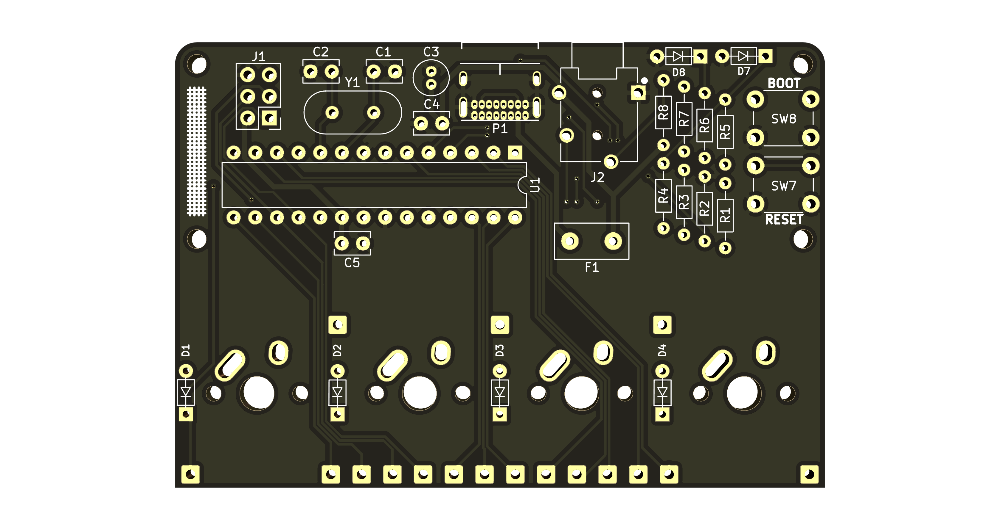

**This is a work in progress for now!**

# Overview

The pin-check will be a printed circuit board (PCB) for hand-wired keyboards that uses all through-hole components. It is inspired by the [Plaid](https://github.com/hsgw/plaid), [Discipline](https://github.com/coseyfannitutti/discipline), and [Postage Board](https://github.com/LifeIsOnTheWire/Postage-Board/blob/master/README.md). It's called the pin-check because pin check is a smaller pattern than plaid and [Gingham](https://yiancar-designs.com/product/gingham/). It will stick up above your case or plate, both to show off the components 😎 and because through-hole components can't fit under the keyswitches on the back side of the PCB like the surface-mounted device (SMD) components of something like Postage Board can.

It might look something like this.

It will use [USBaspLoader](https://github.com/baerwolf/USBaspLoader) as a bootloader.

Eventually this README will include instructions to:

* Design and purchase a plate (probably using [Keyboard Layout Editor](http://www.keyboard-layout-editor.com/), [swillkb](http://builder.swillkb.com/), and [OSH Cut](https://app.oshcut.com/) or another laser cutting service)
* Purchase other case-related things like standoffs and screws
* Get a PCB manufactured (probably using [OSH Park](https://oshpark.com/))
* Purchase the components from the [bill of materials](bom.md)
* Flash USBaspLoader onto the microcontroller unit (MCU), with either the in-system programming (ISP) headers on the PCB or another method (like connecting to the GPIO pins of a Raspberry Pi)
* Solder the components onto the PCB
* Hand-wire some keyswitches together (need some wire and more diodes for this!) and onto the PCB
* Create a keymap, etc. and flash QMK onto the MCU

Things that are not supported/planned for various reasons:

* ~~Split keyboard support~~ (support planned now, just needs to be tested!)
* Per-key LEDs

# Acknowledgments

* Thank you to [coseyfannitutti](https://github.com/coseyfannitutti) who designed the [Discipline PCB](https://github.com/coseyfannitutti/discipline) for the footprints `D_DO-35_SOD27_P5.08mm_Horizontal.kicad_mod` and `USB_C_GCT_USB4085.kicad_mod` in the `pcb/pin-check.pretty/` directory!
* The symbol `SJ-43514` in the `pin-check.lib` symbol library and footprint `CUI_SJ-43514.kicad_mod` in `pcb/pin-check.pretty` are from [CUI Devices](https://www.cuidevices.com/product/resource/pcbfootprint/sj-43514) (with minor modifications to the footprint).
